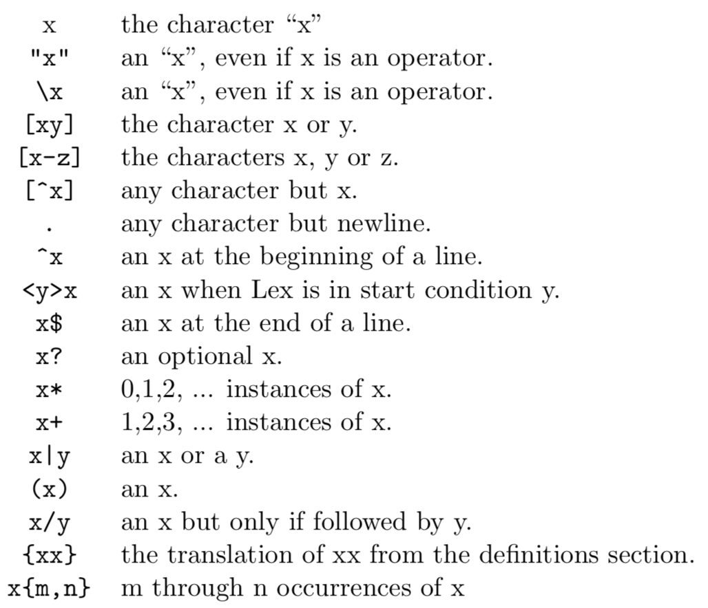
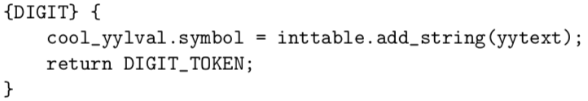

# Lexical Analysis

PA2.pdf and [The Flex Manual](http://westes.github.io/flex/manual/) are useful!

## Tokens

You can find all the tokens in file `utilities.cc`. They are needed for RE definitions (of course for later assignments too).

## Regular Expression

How to define REs for the symbols in flex is specified in the handout:

Besides that, you may need to know some tricks in RE (e.g. using `?i` for case insensitiveness of keywords).

## Rules

If you have no idea of the code structure in the rules, you can refer to the example code in the handout:

To summarize, the key points are the following:

1. `yytext` stores the input string matched.

2. Integers need to be added to the `inttable` by calling `inttable.add_string(yytext)` and the method returns a Symbol object which you need to set `cool_yylval.symbol` with. Similarly, for type identifiers and object identifiers set `cool_yylval.symbol = idtable.add_string(yytext)` before tokens are returned. For bools, however, set `cool_yylval.boolean` to true/false.

3. If the token name is identical to the symbol name put it in parens.

4. Since tokens are actually integers, for single character symbols (if defined together) the return value should be the ASCII code of the character. However, the tricky thing is that `yytext` is of type `char *` so you need to cast the first char of `yytext` to int: `int(yytext[0])`.

5. When an error is expected set `cool_yylval.error_msg` to any string you want to output.

## The Start Condition Feature of Flex

In order to implement nested comments and strings it is essential to read the 'Start Conditions' section of the flex manual: [Start Conditions - Flex Manual](http://westes.github.io/flex/manual/Start-Conditions.html#Start-Conditions). The key points are:

1. Define a symbol to indicate the openning state of an expression. The syntax is `%s` or `%x` followed by a name (e.g. `%x COMMENT`).

2. When the openning part is encountered set the current state as "unmatched" by calling `BEGIN(Symbol)` (e.g. `BEGIN(COMMENT)`).

3. Rules for performing actions under "unmatched" states are written as `<Symbol>[RE]` (e.g. `<COMMENT>[^*\n]* {...}` implements the rule when there is an unmatched comment and `[^*\n]*` is encountered).

4. The default state is "initial". Therefore, when a closing part is encountered under "unmatched" states the current state should be set to "initial" by `BEGIN(INITIAL)` (e.g. `<COMMENT>"*"+")" {BEGIN(INITIAL);}`). On the other hand, when a closing part is encountered under the "intial" state an error should be reported. Whenever an error occurs, the current state should set to "initial".

5. Syntax for EOF in flex is `<<EOF>>`.

6. Remember to increment `curr_lineno` when a newline is encountered.

7. String rules are a little bit complicated. Fortunately, the flex manual provides some of them as example: [Start Conditions - Flex Manual](http://westes.github.io/flex/manual/Start-Conditions.html#Start-Conditions). You should store the content of a string in `string_buf_ptr`.

## Problems

I do not know how to write string length test as a single rule so I put it in every rule, which is really a kind of ugly code style.