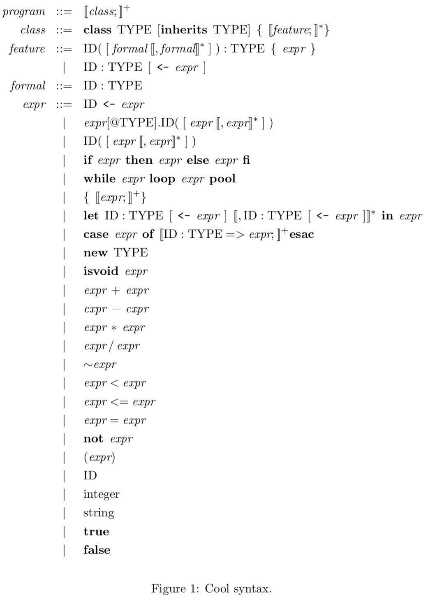

# Parser

PA3.pdf, cool-tour.pdf, cool-manual.pdf and [The Bison Manual](https://www.gnu.org/software/bison/manual/html_node/index.html) are useful!

## Cool Syntax

## Phylum & Constructor

Detailed discussion can be found in Section 6 of *Tour of the Cool Support Code*. To summarize,

1. Phyla are really just types. In fact, they are abstract classes.

2. Constructors are really just classes. In fact, they inherit from phyla. A phylum may have more than one child (e.g. `attr_class` and `method_class` both inherit `Feature_class`).

## Non-terminals

Non-terminals are declared as `%type <TYPE> NAME`. You  can think `TYPE`s as pseudo-types in bison. `TYPE`s are declared in the `%union` part and are one-to-one corresponding to the phyla.

## Precedence

See [Precedence - Bison Manual](https://www.gnu.org/software/bison/manual/html_node/Precedence.html#Precedence).

## Rule Skeleton

You can consider non-terminals as functions. `$$` serves as the role of `return` and the return values must conform to the return types declared, i.e. the `TYPE`s declared for non-terminals. Pattern matching is just the same as that in functional languages and recursion is the core.

The rest of the grammar can be easily implemented by referring to the provided code for `class` and `class_list`.

## Let Expression

The trickiest part of this assignment is the let expression. It is required in the manual that a let expression with multiple bindings should be converted to nested let expressions. This can be done by introducing another non-terminal representing the rest after a ','.

## Problems

I cannot understand the mechanism of `error` in bison so I write the error handling in my own way which will produce shift/reduce conflicts.